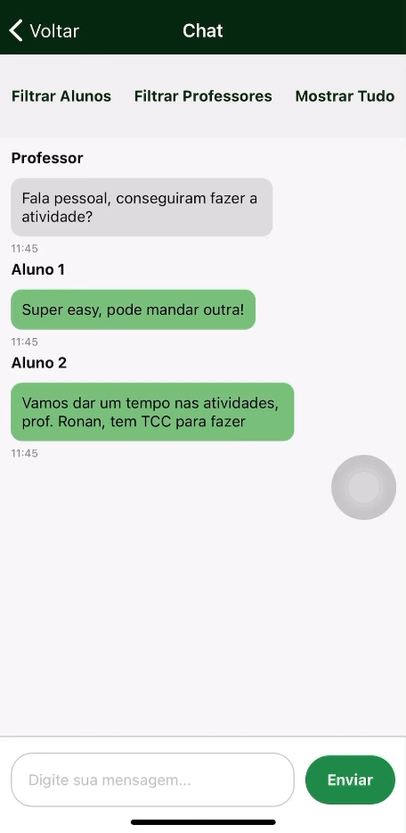

# Chat da Turma IFPR - 8º Semestre
[](https://github.com/primonmari/projeto-semestre/blob/master/LICENSE)  


# Sobre o projeto


Este projeto é um dos desenvolvidos durante a disciplina de Computação Gráfica. Trata-se de uma aplicação mobile que permite o login com um e-mail válido do IFPR para acessar o chat dos alunos, que inclui um filtro para visualização das mensagens.

## Layout mobile

<p align="center">
    
</p>


# Tecnologias utilizadas
## Back end
- Firebase
## Front end
- Javascript
- React Native
- Expo

# Como executar o projeto

## Front end
Pré-requisitos: Firebase Firestore

```bash
# clonar repositório
git clone https://github.com/devsuperior/sds1-wmazoni](https://github.com/primonmari/projeto-semestre.git

# instalar dependências
npm install

# executar o projeto
npx expo start
```

# Autor

Marislene Primon

www.linkedin.com/in/marislene-primon-78b569252

